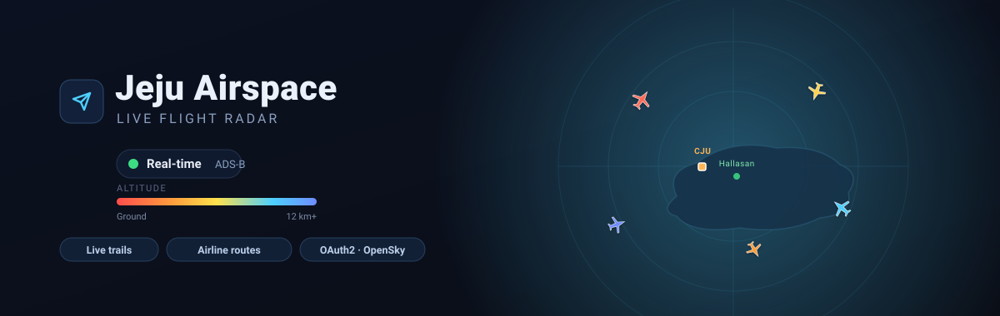

<div align="center">



# Jeju Airspace — Live Flight Radar

**A real-time flight dashboard for the airspace over Jeju Island (제주도), South Korea.**
Live ADS-B aircraft from the [OpenSky Network](https://opensky-network.org/), rendered on a smooth, animated map — planes rotate to their heading, glide between updates, trail their recent path, and colour themselves by altitude or airline.

<br>

[](#)
[](https://leafletjs.com/)
[](https://opensky-network.org/)
[](#-authenticated-live-data-recommended)
[](#)
[](LICENSE)

</div>

---

## ✨ Highlights

| | |
|---|---|
| 🛰️ **Live ADS-B** | Polls OpenSky every 10 s over a Jeju bounding box and renders every aircraft in the area. |
| ✈️ **Smooth motion** | Each plane is **interpolated** between polls with `requestAnimationFrame` — it glides, never teleports. |
| 🌈 **Altitude colouring** | Planes go warm→cool with altitude (ground = red, high = blue) with a matching legend. |
| 🏢 **Airline routes** | Callsigns are decoded to airlines (Korean Air, Asiana, Jeju Air…). Colour by airline and **isolate one carrier to see just its routes**. |
| 🌀 **Trails** | A fading polyline shows each aircraft's last ~10 positions. |
| ⏱️ **Delay / holding detection** | Flags aircraft stuck in **holding patterns** (detected from their track) as possible delays, with a status classifier (Departing / On approach / Holding / En route…). |
| 🛬 **CJU highlight** | Aircraft arriving/departing **Jeju International (CJU / RKPC)** near the runway are highlighted. |
| 🌓 **Dark / light map** | One click. Keyless OpenStreetMap tiles, dark mode via a CSS filter — no API key, no watermark. |
| 🔐 **Authenticated feed** | Bundled zero-dependency Python server does the **OpenSky OAuth2** flow server-side for reliable, higher-rate live data. |
| 🧭 **Never blank** | Graceful fallback chain: **local server → public proxy → synthetic demo**. The map is always alive. |

<div align="center">

**Times in `Asia/Seoul` · Speeds in km/h · All config in one `CONFIG` object**

</div>

---

## 🚀 Quick start

### Option A — see it instantly (demo / anonymous)

```bash
git clone https://github.com/yunseongkim1009/jeju-airspace.git
cd jeju-airspace
python3 -m http.server 5390
```

Open **http://localhost:5390/**. It will try anonymous live data through a public CORS proxy and, if that's rate-limited (it often is — see [caveats](#-a-note-on-the-data)), automatically fall back to a clearly-badged **demo feed** so you can explore every feature.

> ⚠️ Don't open `index.html` via `file://` — browser CORS will block the fetches. Always serve over HTTP.

### Option B — authenticated live data (recommended) 🔐

The bundled `server.py` performs the OpenSky **OAuth2 client-credentials** flow *server-side* (your secret never reaches the browser), attaches the token, and serves everything same-origin — no CORS, higher rate limits, reliable data.

1. Create an API client at OpenSky → **Account → API Client → create**, and copy the `client_id` + `client_secret`.
2. Run the server with your credentials:

```bash
OPENSKY_CLIENT_ID=your_id OPENSKY_CLIENT_SECRET=your_secret python3 server.py
```

3. Open **http://localhost:5390/** — the header will read **`Live · authenticated`**.

Running `python3 server.py` *without* credentials still works and still fixes CORS (it just uses anonymous OpenSky).

---

## 🖥️ The interface

```
┌──────────────────────────────────────────────────────────────┐
│  ✈ Jeju Airspace     ● 12 aircraft   1 delayed   [DEMO]   KST │  ← header
├───────────────┬──────────────────────────────┬───────────────┤
│  DETAIL PANEL │                              │  DATA SOURCE  │
│  (click a     │         L E A F L E T        │  MAP STYLE    │
│   plane)      │           M A P              │  COLOUR BY    │
│  · airline    │    ✈ ✈   with live planes    │  AIRLINES ▸   │  ← controls
│  · status     │      ✈      + trails         │  ALT FILTER   │
│  · altitude   │   ✈    ✈                     │  HIGHLIGHTS   │
│  · speed km/h │                              │               │
├───────────────┴──────────────────────────────┴───────────────┤
│  ALTITUDE ▮▮▮▮▮▮  Ground → 12 km+           © OpenStreetMap    │  ← legend
└──────────────────────────────────────────────────────────────┘
```

- **Click any aircraft** → side panel: airline, flight status, delay, origin country, altitude, ground speed (km/h), heading (+ compass), vertical rate.
- **Colour Planes By** → `Altitude` or `Airline`.
- **Airlines In View** → click a carrier to isolate only its aircraft and routes; *Show all* to reset.
- **Altitude filter** → show only planes above / below a threshold.
- **Highlight delayed / holding** → pulsing ring around flagged aircraft.

---

## 🧠 How it works

### Data pipeline

```
OpenSky state vectors ──▶ normalize ──▶ enrich ──▶ ingest() ──▶ render
   (array-index format)     (parse)   (airline,   (upsert     (markers,
                                        status,    + prune)     trails,
                                        delay)                  panel)
```

Every OpenSky "state" is a flat array; the app reads it by documented index (`icao24=0`, `callsign=1`, `longitude=5`, `latitude=6`, `baro_altitude=7`, `velocity=9`, `true_track=10`, `vertical_rate=11`…). Positions are lerped each animation frame so motion is continuous between the 10 s polls.

### The CORS reality & the fallback chain

OpenSky **does not send permissive CORS headers**, so a browser page *cannot* call it directly — and it now uses OAuth2 for authenticated access. This app handles it with a three-step source chain, tried in order:

```
1. Local server  (/api/states)  →  OAuth2, same-origin, no CORS, higher limits   ✅ best
2. Public proxy  (allorigins)   →  anonymous, shared IP, frequently rate-limited  ⚠️ flaky
3. Demo feed     (synthetic)    →  realistic Jeju traffic through the same pipeline 🧪 never blank
```

Live failures auto-fall back; a valid response promotes back up. Errors, empty boxes, and rate limits are all handled without ever breaking the poll loop or losing the last good data.

---

## ⚙️ Configuration

Everything tweakable lives in the `CONFIG` object at the top of [`index.html`](index.html):

| Key | Default | What it does |
|---|---|---|
| `bbox` | `33.0–33.7 N, 126.0–127.0 E` | Bounding box queried from OpenSky. |
| `center` / `zoom` | `[33.51, 126.52]` / `9` | Initial map view (Jeju City). |
| `pollInterval` | `10000` ms | Time between polls. Raise this before you hit rate limits. |
| `trailLength` | `10` | Positions kept per aircraft trail. |
| `airport` | CJU / RKPC | Runway location + radius for the arrival/departure highlight. |
| `proxy` | allorigins | Public CORS proxy used when the local server isn't running. |
| `demo.count` | `12` | Synthetic aircraft in demo mode. |
| `timeZone` | `Asia/Seoul` | Timestamp locale. |

Server-side (`server.py`) reads `OPENSKY_CLIENT_ID`, `OPENSKY_CLIENT_SECRET`, and `PORT` from the environment.

---

## 🔎 A note on the data

A couple of honest limitations, by design:

- **OpenSky's anonymous tier is tight** (~1 request / 10 s, shared) and its public-proxy IP is frequently rate-limited. For dependable live data, use the [authenticated server](#-authenticated-live-data-recommended).
- **There is no schedule/delay field in OpenSky's live feed.** It's raw ADS-B — position, speed, altitude. So "delayed" here means a detected **holding pattern** (aircraft circling near the field), which is the best real-time proxy available without a paid schedule API. In demo mode, delays are assigned so the feature is fully visible. Wiring in a schedule provider (AeroDataBox / FlightAware) is a natural next step.

---

## 🧰 Tech stack

- **Frontend:** vanilla JavaScript + [Leaflet](https://leafletjs.com/) (CDN). No build step, no framework — one `index.html`.
- **Tiles:** OpenStreetMap (keyless); dark mode via a CSS filter on the tile pane.
- **Data:** [OpenSky Network REST API](https://openskynetwork.github.io/opensky-api/rest.html) (`/states/all`).
- **Server:** Python 3 standard library only (`http.server`, `urllib`) — no `pip install`.

## 📁 Project structure

```
jeju-airspace/
├── index.html    # the whole dashboard (HTML + CSS + JS, heavily commented)
├── server.py     # optional OAuth2 + static server (zero dependencies)
├── banner.svg    # header artwork
└── README.md
```

---

## 📜 License

[MIT](LICENSE) — do whatever you like. Aircraft data © the [OpenSky Network](https://opensky-network.org/); map tiles © [OpenStreetMap](https://www.openstreetmap.org/copyright) contributors.

<div align="center">
<br>
<sub>Built with vanilla JS and a lot of respect for people who make free flight data possible. ✈️</sub>
</div>
